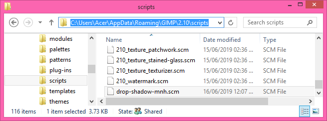
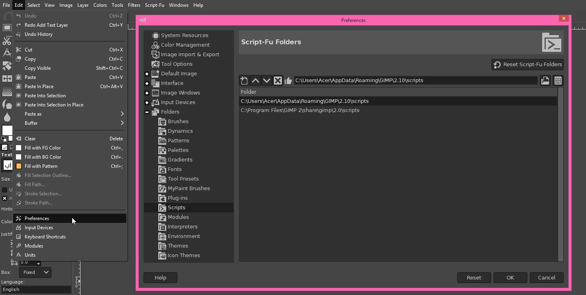
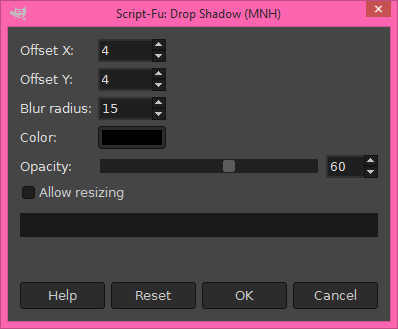

# GIMP Scripts
## What is this repository about?
This is just a collection of GIMP script-fus that I've initially
created for my personal use. All of them are just automation
scripts which call functions from other scripts to do the job
for me. 

I highly suggested you to also use the script bundle by Paul
Sherman which is available on his website [www.gimphelp.org](http://www.gimphelp.org/index.html).
He has a lot of very useful scripts that I personally used, and
I only create custom script if it's not available in his bundle.
He's still updating his bundles and he's preparing scripts for
the upcoming version 3.0 of GIMP.

## What is The GIMP?
GIMP, short for The GNU Image Manipulation Program, is a free
and open sourced cross-platform raster image editor released
under the GNU GPLv3. It is usable for all kind of raster image
editing, basically anything that you could manipulate with
pixels can also be edited with GIMP.

You can download GIMP from its [official website](https://www.gimp.org/).

## What is script-fu?
Script-fu is a dialect of [Scheme](https://en.wikipedia.org/wiki/Scheme_(programming_language)) (which by itself is one of three main dialects of [Lisp](https://en.wikipedia.org/wiki/Lisp_(programming_language))). It is
one of the scripting languages available for GIMP, and it is the
only scripting language installed by default on GIMP. Script-fu
is the equivalent of "macros" elsewhere where it is used to
automate anything that needs to be done frequently or too
complicated to be done manually. While script-fu is also
considered as plug-in, it has its own directory `scripts`.

Other than Script-fu, you can also write plug-ins for GIMP in
the C, Python, or Perl programming languages. Most of the third
party plug-ins currently available are written in Python,
however. These go to the `plug-ins` directory.

## How to install the scripts?
To install the script, please place it in the user or system-wide
`scripts` folder/directory.

NOTE: Replace `USERNAME` with the operating system username that you're using.

### Windows Vista/7/8/10
System-wide: `C:\Program Files\GIMP 2\share\gimp\2.0\scripts`

User (2.8): `C:\Users\USERNAME\.gimp-2.8\scripts`

User (2.10): `C:\Users\USERNAME\AppData\Roaming\GIMP\2.10\scripts`

### Windows XP
System-wide: `C:\Program Files\GIMP 2\share\gimp\2.0\scripts`

User (2.8): `C:\Documents and Settings\USERNAME\.gimp-2.8\scripts`

Version 2.10 and above no longer support Windows XP (as noted [here](https://www.gimpusers.com/forums/gimp-user/20647-2-10-for-xp)).

### Linux
System-wide depends on your Linux flavour, check [here](https://en.wikibooks.org/wiki/GIMP/Installing_Plugins#Linux) for more information.

System-wide (Ubuntu 32-bit): `/usr/lib/gimp/2.0/scripts`

System-wide (Ubuntu 64-bit): `/usr/lib64/gimp/2.0/scripts`

User (2.8): `/home/USERNAME/.gimp-2.8/scripts`

User (2.10): `/home/USERNAME/.gimp-2.10/scripts`

### Mac
System-wide: `/Applications/GIMP.app/Contents/Resources/share/gimp/2.0/scripts/`

User (2.8): `$HOME/Library/Application Support/GIMP/2.8/scripts/`

User (2.10): `$HOME/Library/Application Support/GIMP/2.10/scripts/`

### Other OS
Please follow instructions provided by your OS. System-wide
`scripts` directory is usually located within the GIMP installation
directory, whereas user `scripts` directory is usually located
within the user's own home directory.

### Alternative
Alternately, you can look into the paths mentioned in GIMP's
preferences menu for the exact path to the folder/directory.

## What's available here?
Currently I have the following script here:

### drop-shadow-mnh.scm
`drop-shadow-mnh.scm` (Drop Shadow (MNH)) is a script that calls the
drop-shadow function 4 times with different parameters.

It accepts positive value from the offset-x and offset-y setting,
then it will call drop-shadow function with the same parameters
except the offset-x and offset-y are edited as follow:
- Pass original values
- Pass negate of offset-x and original offset-y
- Pass original offset-x and negate of offset-y
- Pass negates of both offset-x and offset-y

Download it [here](./drop-shadow-mnh.scm).

## What is the license?

These scripts are licensed under the [GNU GPLv3](./LICENSE) just like
GIMP itself and like most of other scripts available for GIMP.
